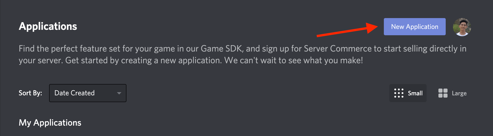
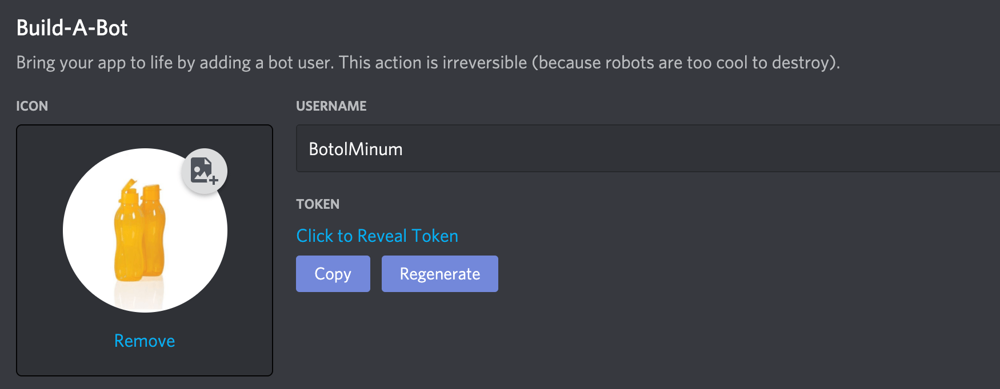
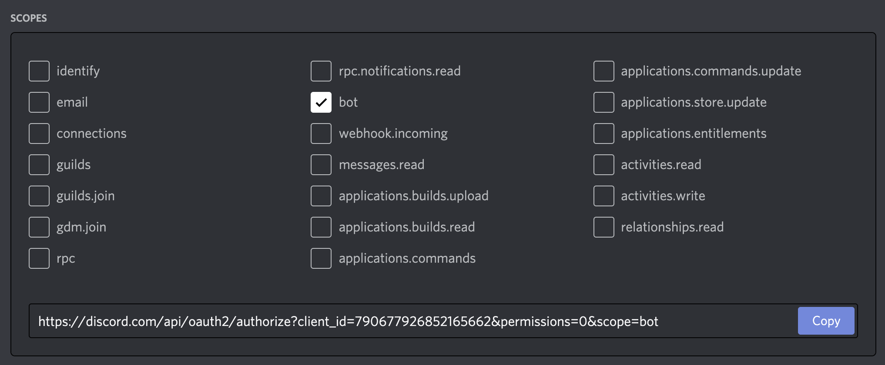
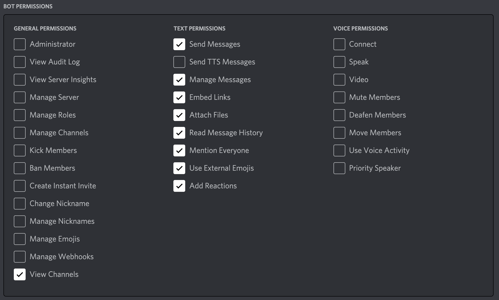
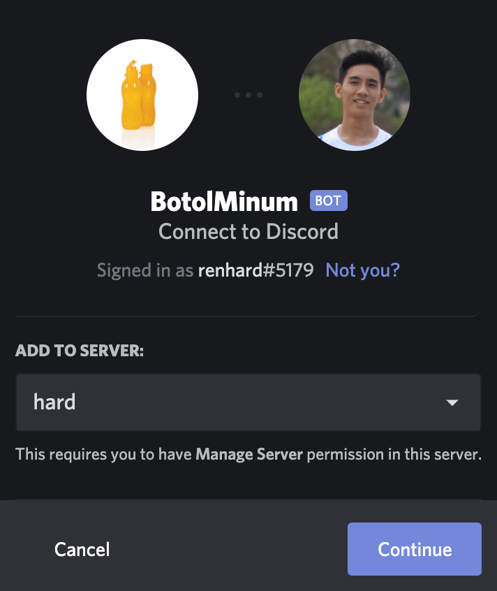

[Home](./README.md)

# 0. Persiapan

Untuk mengikuti tutorial ini, pastikan kamu sudah memiliki:
1. Akun Discord
2. Server Discord  
sebaiknya gunakan server Discord baru yang khusus untuk testing
3. Node.js

## Pendaftaran Aplikasi & Bot

Bot pada Discord termasuk dalam kategori aplikasi, sehingga perlu didaftarkan terlebih dahulu

1. Buka [Developer Portal](https://discord.com/developers/applications) dan pilih `New Application`

2. Berikan nama aplikasi sesuai keinginan kamu (tenang saja, bisa diubah kok) dan klik `Create`
3. Pada sidebar settings, pilih `Bot`
4. Klik `Add Bot` pada bagian `Build-A-Bot`
5. Ubahlah Icon dan Username untuk Bot kamu

## OAuth2 URL

Bot pada Discord ditambahkan ke server melalui OAuth URL khusus dan unik

1. Pada sidebar settings, pilih `OAuth2`
2. Pada bagian OAuth2 URL Generator - **scopes**, centang pilihan bot

3. Pada bagian OAuth2 URL Generator - **bot permissions**, kamu dapat centang untuk setiap permission yang kamu butuhkan atau mengikuti contoh berikut

4. Kembali ke bagian atas OAuth2 URL Generator - **scopes**, copy URL yang sudah digenerate
5. Buka URL tersebut pada tab baru dan pilih server yang telah disiapkan sebelumnya

6. Klik `Continue`, kemudian `Authorize` semua permission

Pada tahap ini, kamu sudah berhasil membuat & menambahkan bot ke server kamu :tada:

[Next: 1. Hello Bot](./01-hello-bot.md)