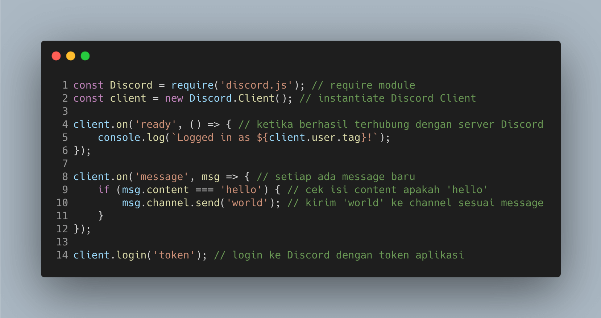
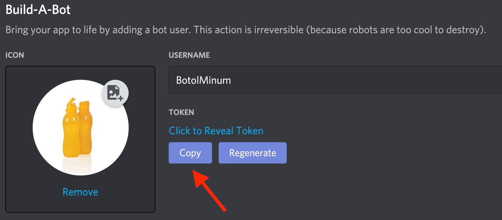

[Home](./README.md)  
[Back: 0. Persiapan](./00-persiapan.md)

# 1. Hello Bot

Sebelum membuat bot yang kompleks, sebaiknya diawali dengan membuat bot yang paling sederhana terlebih dahulu

1. Buatlah folder baru untuk meletakkan kode dari bot yang akan dibuat
2. Jalankan `npm init -y` pada folder baru tersebut
3. Kemudian, jalankan `npm install discord.js` yang akan menginstall module [discord.js](https://discord.js.org/#/) untuk memudahkan development bot
4. Buatlah file `index.js`
5. Tuliskan kode berikut pada `index.js`

6. Buka kembali halaman aplikasi pada developer portal, pada sidebar settings, pilih `Bot`, kemudian pilih `Copy` Token

7. Pada `index.js` line 14, ubahlah `token` menjadi Token yang baru dicopy
8. Jalankan `node index.js`
9. Jika pada terminal sudah muncul `Logged in as NamaBot...`, lakukan testing pada text channel dari server yang digunakan

10. Bagaimana bot ini bekerja? Inti dari bot ini ada pada line 8-12, dimana kode tersebut akan berjalan setiap ada message baru di text channel, kemudian dilakukan pengecekan isi message tersebut menggunakan `.content` sesuai [dokumentasi](https://discord.js.org/#/docs/main/12.5.1/class/Message?scrollTo=content), lalu menggunakan method [`.send`](https://discord.js.org/#/docs/main/12.5.1/class/TextChannel?scrollTo=send) untuk mengirimkan message ke channel yang sesuai

Selamat! kamu sudah berhasil membuat Hello Bot  
> Token bisa disimpan di file .env agar lebih aman

[Next: 2. Poll Bot](./02-poll-bot.md)