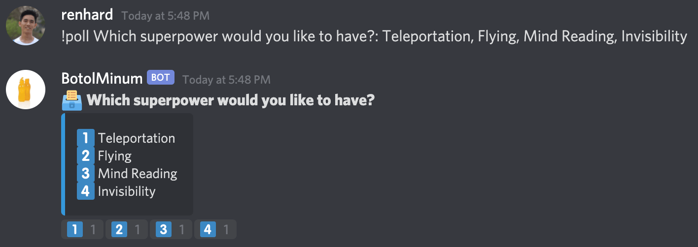

[Home](./README.md)  
[Back: 1. Hello Bot](./01-hello-bot.md)

# 2. Poll Bot

Saatnya membuat bot yang sedikit lebih berguna, yaitu Poll Bot yang dapat membantu untuk mempermudah pengambilan voting bersama dengan memanfaatkan emoji/reaction

## Yes/No Poll
Pada poll ini user dapat memberikan pertanyaan atau statement yang ingin divoting, selanjutnya bot akan mengirimkan ulang pertanyaan/statement tersebut beserta emoji/reaction yang dapat dipilih oleh semua member

Format message sebenarnya bebas, namun pada contoh ini menggunakan format   
```!poll question/statement```

Terdapat 3 tahapan yang perlu dilakukan untuk membuat fitur ini:
1. Melakukan pengecekan apakah message sesuai format dan mengekstrak pertanyaan/statement dari message tersebut
2. Mengirimkan ulang pertanyaan/statement
3. Memberikan template reaction 👍 👎 sebagai pilihan

Setelah mengetahui tahapannya, maka kode event `message` pada `index.js` dapat diubah menjadi


## Multiple Choice Poll
Setelah berhasil membuat Yes/No Poll, sekarang saatnya kamu untuk mengembangkan bot tersebut agar dapat mensupport poll dengan multiple choice. Format messagenya bebas atau dapat mengikuti contoh  
```!poll question/statement: choice1, choice2, choice3```

Tentukan apa saja tahapan yang perlu dilakukan, kemudian implementasikan menjadi kode ya!

> Tips: untuk membuat output seperti contoh gunakan `embed` pada method [`.send`](https://discord.js.org/#/docs/main/12.5.1/class/TextChannel?scrollTo=send)

[Next: 3. Mempublikasikan Bot](./03-mempublikasikan-bot.md)