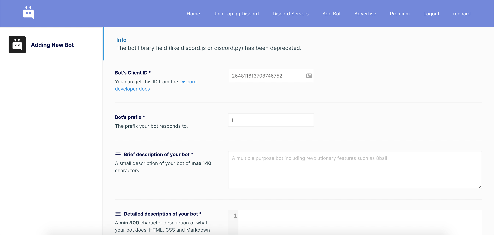

[Home](./README.md)  
[Back: 2. Poll Bot](./02-poll-bot.md)

# 3. Mempublikasikan Bot

Untuk mempublikasikan bot sebenarnya cukup dengan membagikan OAuth2 URL yang digenerate pada [0. Persiapan](./00-persiapan.md#oauth2-url), namun agar lebih mudah diketahui dan digunakan oleh orang lain, sebaiknya daftarkan juga bot yang telah kamu buat ke [top.gg](https://top.gg/)
